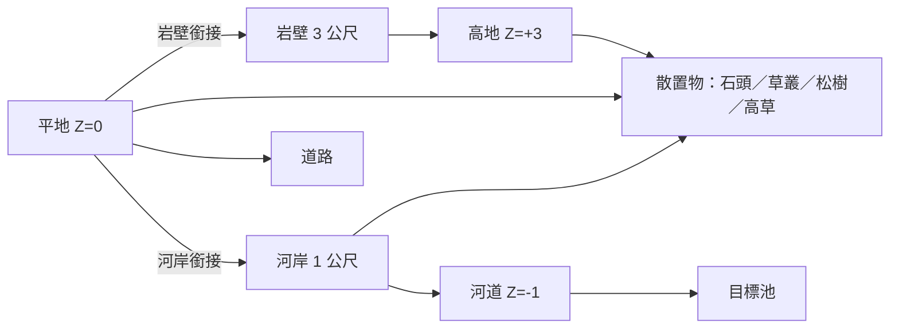

# ESMO 地形概念書 — Sprint 30A（第一階段）

> **狀態：僅概念（Concept），尚未進入製作。** 本階段完全沒有開啟 Blender、沒有產生任何
> 模型、資產或資產包（Asset Pack）。這份文件是給您審核用的「產品規格書」，確認之後才會
> 進入第二階段（用 Blender 實際建模）。

**這份文件在說什麼（一句話）：** 我們要先做一小塊約 20×20 公尺的地面，用它來驗證「ESMO
的世界長什麼樣子」，並訂下未來整張地圖都會沿用的地形設計規則——不是要把整張地圖做完。

本文件依 ESMO 美術規範（Visual Bible，AI 內部英文文件）的「動工前分析」流程撰寫。

---

## 1. 設計目標（Terrain Design Goal）

我們要打造的是**地形基礎（Terrain Foundation）**——一小塊「做對了」的 ESMO 世界切片，
用來證明世界風格與地形規則，讓未來每一張地圖都能沿用同一套語言。

「成功」不是把地圖做完，而是達成以下四點：

1. **三層地形**（高地／平地／河道）從上帝視角（由上往下看的遊戲鏡頭）一眼就能分辨。
2. 岩壁、河岸、河道、高低差看起來都屬於**同一個 ESMO 世界**，風格一致。
3. 每個部件都用**模組化（Modular，可重複拼接）**的方式製作，未來能直接放大成整張地圖，
   不必重做。
4. 在真實 3D 中驗證美術規範的數值（比例、配色、材質、光影），確認後就把它們鎖定為基礎。

---

## 2. 參考綜合分析（動工前必做）

依規範，動工前先重新看過 `docs/reference/moba-map/` 裡**所有**參考圖（2 張俯視全圖、
4 張近景圖；影片作為光影與動態參考，靜態畫面作為造型依據），並歸納**所有圖片的共同點**
——我們要學的是這套「設計語言」，而不是照抄任何單一張圖：

- **地形用明暗層次來閱讀。** 由上往下看：明亮的可行走草地 → 暖褐色的道路 → 深色的植被牆
  → 灰色石頭與岩壁 → 最暗且下凹的水面。每種功能各占一個明暗階，所以一眼就看得懂。
- **三條垂直高度在主導畫面：** 可行走的基準平面、由矮岩壁撐起的**高地**、以及下凹的
  **河道**。高低差一律用「有稜有角、帶水平紋理的硬岩邊緣」來表現，絕不用平滑的斜坡。
- **河道是圓潤下凹的青綠色水道**，末端會放大成一個發光的**目標池**；河岸是石頭與泥土的
  淺灘，邊緣鋪上石頭與高草。
- **輪廓（Silhouette，物體的剪影外形）用一組彼此對比的少數形狀：** 圓潤柔軟的草叢、
  尖銳分層的松樹、方塊分層的石頭與岩壁、低矮連續的石牆。每種玩法功能各自擁有一種剪影。
- **材質偏手繪平塗**：向上的面點綴青苔，沒有寫實貼圖；水面是平塗青綠色加一點邊緣發光。
  全場只有一個一致方向的主光；陰影都聚在凹處（水面、岩壁背面）。

**ESMO 自己的方向（我們刻意的不同，讓它是「我們的」而非模仿）：** 走「競技場」感，而不是
野生叢林——道路邊緣更乾淨、草地更明亮開闊、植被刻意排成「牆」來切割空間，並使用 ESMO 的
招牌強調色：**青色（目標）** 與 **琥珀色（標記／守衛）**。我們從這些「原則」建立 ESMO 風格，
不使用任何 Riot 官方的模型、貼圖、配置或造型。

---

## 3. 世界比例（World Scale）

- **1 單位 = 1 公尺。** 一名英雄的身高約 **1.8～2.0 公尺**，所有東西都以英雄為基準衡量。
- 本次原型的範圍：**20 × 20 公尺**（一塊「看得懂的世界磚」）。

| 元素 | 尺寸（公尺） |
|---|---|
| 岩壁一階（一個高度差） | 高 3.0～4.0 |
| 河道深度（比平地低） | 0.5～1.5 |
| 草叢（Bush） | 高 0.7～1.0、寬 1.5～3 |
| 石頭（Rock） | 0.5～3.0 |
| 松樹（主樹／幼樹） | 4～7／2～3 |
| 道路寬度 | 2.5～4（可兩名英雄並行） |

---

## 4. 地形分層（Terrain Layer）

三個高度層，是整套系統的骨幹：

| 分層 | 高度 Z（公尺） | 功能 | 表面 |
|---|---:|---|---|
| **高地**（抬高的叢林平台） | **+3.0** | 高處、野區空間 | 高地草地＋植被 |
| **平地**（可行走基準面） | **0.0** | 主要戰鬥平面、路線 | 草地＋泥土路 |
| **河道**（下凹水道） | **−1.0** | 邊界／目標 | 青綠水面＋河岸 |

兩個「銜接處」是刻意設計的重點：

- 平地 →高地＝**岩壁一階**（有稜角的硬岩牆，一段 3 公尺）。
- 平地 →河道＝**河岸**（一小段 1 公尺的石頭與泥土斜坡，不是牆）。

---

## 5. 河道設計（Riverbed）

- **圓潤、下凹的水道**，斜切過東南角；水面在 **Z = −1.0 公尺**。斷面是柔和的 U 形，
  絕不是尖銳的深溝。
- **雙色平塗水面：** 邊緣用淺水青綠（`#2A6B73`）→ 中央用深水藍綠（`#153348`）。平塗加
  一點邊緣微光；**不用**寫實反光水面（不符風格，且在手機上太耗效能）。
- 水道末端**放大成圓形目標池**，中央有**青色（Objective Cyan，`#33C0D9`）發光**——ESMO
  招牌色，只用在很小的面積。
- **可讀性：** 水是最暗、最凹的層，一眼就讀成「不同層／邊界」，不會和陰影裡的草地混淆。

---

## 6. 河岸設計（Riverbank）

- 平地（Z=0）與水面（Z=−1）之間，是一段 **1 公尺高的石頭與泥土淺灘**：一小段斜坡而非
  垂直牆，讓玩家一看就懂「這裡可以走近水邊」。
- 岸邊**鋪上石頭與高草**（泥土色＋暖灰石色，濕接縫處帶青苔）；高草叢標出確切的水線位置。
- 在水道最窄處架一條**石板渡口（Ford，可踏踩的石板橋）**——平坦石板約在 Z=−0.2——用來
  對比出「可行走的通道」與「阻擋的水面」，驗證可讀性。

---

## 7. 岩壁設計（Cliff）

- 平地 → 高地的邊界是一道**分層方塊狀的石岩壁**，一段 **3 公尺**高。
- **近乎垂直、切面分明的岩面**（正面暖灰石色、背光垂直面用冷灰色），有清楚的**水平紋理帶**；
  頂緣的平台邊覆上**青苔**。
- 頂線要粗獷破碎（不是被擠出來的斜坡）。做成**模組化岩壁段落**（直段＋內轉角＋外轉角＋
  收尾），讓整段高地邊緣只用少數幾種部件重複、旋轉拼出——這就是未來整張地圖岩壁套件的種子。
- 壁腳散落一些**石頭碎塊**，讓高低銜接更自然。

---

## 8. 高低差設計（Elevation）

- 原型只用**三層**（+3／0／−1）——足以證明系統，又少到能保持清楚。
- 每個高度銜接都**從上帝視角一眼可辨**：岩壁＝灰色有稜的硬邊帶；河岸＝帶草的柔和石土斜坡。
  玩家永遠不用猜「這塊地能不能走」。
- 基準地面保持**視覺乾淨**（細節放在邊緣與物件上），讓高度差讀成乾淨的剪影階梯，而非雜訊。

---

## 9. 玩家視角下的可讀性（Readability）

由上往下、2.5D 斜視角下的辨識度是最高優先，高於寫實、高於細節。

- **明暗層次**（亮 → 暗）：高地草地 ≈ 平地草地（亮）→ 泥土路（暖中間調）→ 草叢牆（深綠）
  → 岩壁／石頭（灰）→ 水面（深青綠、下凹）。
- **用顏色＋剪影分辨功能：** 道路＝暖褐；草叢＝深綠圓團；岩壁＝灰色分層帶；水＝下凹青綠；
  目標＝青色發光；守衛／火把＝琥珀色。
- **不同功能的剪影必須不同：** 圓草叢 vs 尖松樹 vs 方塊石頭／岩壁——絕不讓兩種不同功能
  共用同一種外形。
- **縮小測試：** 把整塊縮到全螢幕小圖時仍要看得懂；任何元素糊成一團，就先簡化它的剪影、
  拉高它的明暗對比，才算過關。

---

## 10. 模組化地形套件規劃（Modular Terrain Kit）

原型用**格線上的模組部件**製作（一般 1 公尺格；大型岩壁／牆段用 2 公尺格），部件的定位點
在底部中心貼地，正面朝 +Y 方向，讓同一套語言能無縫拼成整張地圖。第二階段的基礎套件：

| 套件群 | 部件（第二階段最少需要） |
|---|---|
| **地面** | 平地磚、高地磚、道路條 |
| **岩壁** | 直段、內轉角、外轉角、收尾（3 公尺） |
| **河岸** | 直段淺灘、轉角淺灘、渡口石板 |
| **河床** | 水道段、目標池段 |
| **散置物**（沿用現有資產） | 石頭 ×3～5、草叢 ×3～5、松樹 ×3～5、高草 |

命名規則：`esmo_terrain_<群組>_<部件>`（例如 `esmo_terrain_cliff_corner_in`、
`esmo_terrain_bank_ford`）。相鄰部件共用相同的邊緣接口，拼起來不留縫。散置物沿用現有的
石頭／松樹／草叢流程，未來各自擴充成 3～5 變體的**資產包（Asset Pack）**；但第二階段只用
最少量來點綴這塊地。

---

## 11. 未來如何擴充成完整 MOBA 地圖

因為一切都是「格線模組化語言」，基礎能無痛放大：

1. **鋪開平地與高地**：在更大的格線上鋪磚；用堆疊岩壁段（每段 3 公尺）抬高或降低平台，
   做出多層野區。
2. **延伸河道**：把水道段一段段接長；在需要中立目標的地方放入目標池段。
3. **切出路線**：用道路條＋草叢牆切出路線（草叢套件可串成參考圖裡那種長條植被走廊）。
4. **框住競技場**：用外圍**牆／遺跡套件**＋深色松樹林邊界包住地圖（屬後續 Sprint）。
5. **雙方基地**：秩序方（藍）與混沌方（紅）放在對角，只用強調色（藍／紅）區分，維持地圖
   對稱與公平閱讀。

每一步都是「加更多部件」，而不是「重做世界」——這就是先做地形基礎的意義。

---

## 12. 藍圖（Blueprint）：20 × 20 公尺配置

### 圖例（Legend）

| 符號 | 意義 | 符號 | 意義 |
|---|---|---|---|
| `▲ 高地` | 抬高的平台（Z=+3） | `≈ 河道` | 下凹水面（Z=−1） |
| `█ 岩壁` | 3 公尺硬岩牆 | `～ 河岸` | 石土淺灘（水線） |
| `： 土路` | 泥土道路 | `＝ 渡口` | 可踏踩的石板橋 |
| `． 草地` | 可行走平地（Z=0） | `✦ 目標池` | 青色發光目標 |
| `🌲 松樹` | 松樹（單棵或叢） | `🌿 草叢` | 草叢／植被牆 |
| `● 石頭` | 石頭、碎石 | `＂ 高草` | 水邊高草 |

### 俯視示意圖（上＝北，左＝西；此為示意，非精確格點）

```
        西  ←─────────────────────────────────→  東
   北  🌲🌲 ．．．．：．．．．．█ ▲▲▲▲▲🌲▲
    │  🌲 ．．．：：．．．．．█ ▲▲🌲▲▲▲▲
    │  ．．●．．：．．．．．██ ▲▲🌿🌿▲▲          高地（松樹＋草叢）
    │  ．．．．．：．．●．．．█ ▲▲▲🌲▲▲
    │  ．🌿🌿．．：．．．．．██ ▲▲●▲▲            岩壁沿高地南／西緣
    │  🌿🌿🌿．．：．．●．．．█ ██▲▲▲
    │  ．🌿．．．：．．．．．．█ ██▲．．
    │  ．．．．．：．．．●．．．█ ～～．●          （壁腳散落石頭）
    │  ●．．．．：．＝＝～≈≈≈≈≈≈≈～．．
    │  ．．●．．：：：～≈≈≈≈≈≈≈≈≈≈～          渡口跨越河道窄頸
    │  ．．．．．．：＂～≈≈≈≈≈≈≈≈≈≈≈～
    │  🌲．．．．．：＂～≈≈≈≈≈≈✦≈≈≈≈≈
    │  ．．●．．．：＂＂～≈≈≈✦✦✦≈≈≈           目標池（青色發光）
    │  ．🌿🌿．．．：．＂～≈≈≈✦✦≈≈≈～
   南  ．🌿．●．．：．．＂～～≈≈≈≈≈～．
```

**看懂這塊地：**
- **東北＝高地**（▲，Z=+3）：一塊叢林平台，上面有松樹叢與草叢，南、西兩側用 3 公尺**岩壁**
  （█）圍邊，壁腳散落石頭。
- **東南＝下凹河道**（≈，Z=−1）：斜切入角落的**目標池**（✦，青色發光）；河岸淺灘（～）與
  高草（＂）沿岸鋪設。
- **中／西／南＝可行走平地**（．，Z=0）：西南有一道**草叢牆**（🌿）塑造走廊，並以石頭（●）
  當路緣。
- **泥土路**（：）自西北角往南延伸，於河道窄頸以**石板渡口**（＝）橫越——這就是「可走 vs
  阻擋」的可讀性驗證。
- **松樹**（🌲）點綴在西北角，作為森林邊界的起點。

### 高度斷面示意（西 → 東：平地 → 岩壁 → 高地；平地 → 河道）

```
 高地 +3 ┤                     ┌──────────────  高地平台
         │               岩壁  │████
 平地  0 ┤──── 土路 ─────────┘████  ．．．．．．．  可行走平地
         │                              \___
 河道 −1 ┤                                  \～ 河岸 ～ ≈≈≈≈  目標池
         └──────────────────────────────────────────────────→
           西                                              東
```

### 地形語法（部件如何組合）



---

## 13. 下一階段（Phase 2）預告（尚未開始）

您確認本概念後，第二階段才會依 ESMO 美術規範用 Blender 把上述內容做出來：模組化套件部件
＋少量散置物，輸出成 `.glb` 模型檔放到 `review/terrain-prototype/`，並附一張渲染預覽圖，
交給您審核——**不會**匯入正式遊戲。

**目前正等待您確認這份地形概念書。尚未進入 Blender、尚未產生任何地形、資產或資產包。**

---

## 附錄：名詞小辭典（給沒有相關背景的讀者）

- **Blender**：一套免費的 3D 建模軟體，用來做出地形與物件的立體模型。
- **GLB**：一種 3D 模型檔案格式，做好的模型會存成 `.glb` 交付。
- **面數（tri / 三角面）**：模型由許多小三角形組成，面數越多越細緻但越吃效能；手機上要控管。
- **材質（Material）／PBR**：物體表面的顏色與質感設定；PBR 是一種寫實材質做法，本專案刻意
  用較平塗、非寫實的風格。
- **輪廓（Silhouette）**：把物體看成純黑剪影時的外形，是遊戲辨識度的關鍵。
- **模組化（Modular）**：像積木一樣可重複拼接的部件，方便快速組出大地圖並維持一致。
- **上帝視角／2.5D**：MOBA 常見的由上往下、略帶斜角的遊戲鏡頭。
